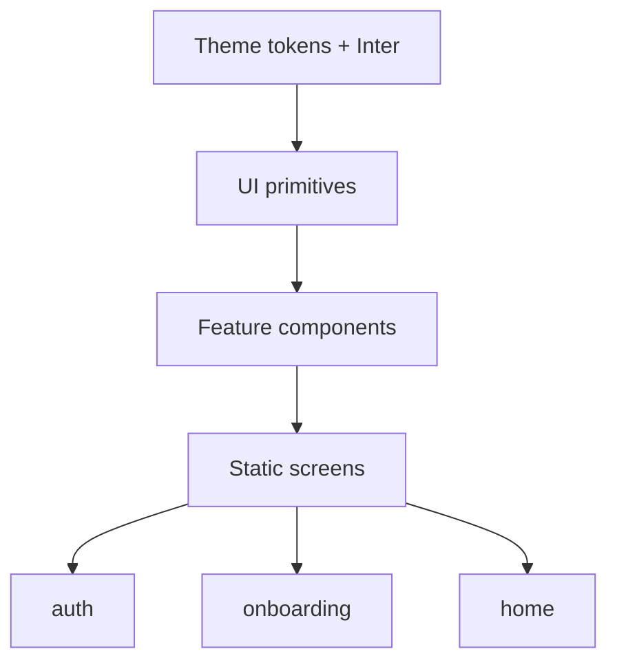

# Expo UI Design Port (UI Only)

Mirror the web app’s quiet emerald habit-app look in Expo. No Clerk, no API calls, no persistence—static mock data and pressable chrome that only navigates between design screens.

## Source of truth (web)

- Tokens: [`quran-tracker/src/app/globals.css`](/home/umair/Projects/quran-tracker/src/app/globals.css)
- Screens: signed-out shell in [`layout.tsx`](/home/umair/Projects/quran-tracker/src/app/layout.tsx), home in [`page.tsx`](/home/umair/Projects/quran-tracker/src/app/page.tsx), onboarding in [`onboarding/page.tsx`](/home/umair/Projects/quran-tracker/src/app/onboarding/page.tsx)
- Feature UI: `home-header`, `check-in-button`, `weekly-calendar`, `timezone-form`

## Target (mobile)

Greenfield Expo Router + NativeWind 4 (SDK 57). Only [`src/app/index.tsx`](/home/umair/Projects/quran-tracker-app/src/app/index.tsx) exists today (placeholder). Keep NativeWind; do not introduce a second styling system.



## 1. Design tokens + fonts

- Extend [`tailwind.config.js`](/home/umair/Projects/quran-tracker-app/tailwind.config.js) and [`globals.css`](/home/umair/Projects/quran-tracker-app/globals.css) with web semantic colors as hex (NativeWind-friendly):
  - primary `#0F9F59`, background white / dark `#121212`, muted grays, border, destructive
  - radius scale with base **16px** (`rounded-lg` = buttons/inputs)
- Load **Inter** via `@expo-google-fonts/inter` in root [`_layout.tsx`](/home/umair/Projects/quran-tracker-app/src/app/_layout.tsx); gate render until fonts load
- Dark mode: follow system (`userInterfaceStyle: "automatic"` already set); map `dark:` variants to the web `.dark` palette
- Safe-area + StatusBar wired in root layout; Stack headers hidden to match web’s chrome-free look

## 2. Shared UI primitives

Create `src/components/ui/`:

| Component | Look (from web) |
|-----------|-----------------|
| `Button` | Variants: primary / outline / secondary / ghost; sizes sm–lg; `rounded-lg`; emerald primary |
| `Input` | `h-10`, bordered, muted placeholder |
| `Text` | Typed roles (title, body, muted, brand) so screens stay consistent |

Icons: Lucide React Native (`lucide-react-native`) for chevrons, globe, check—same sparse usage as web.

## 3. Feature components (static props)

Create `src/components/`:

- **`HomeHeader`** — greeting + extrabold streak headline + “Best streak” line; circular avatar placeholder top-right
- **`CheckInButton`** — large CTA; muted “Did you read Quran today?” vs solid emerald “Read today” via a boolean prop (toggleable in UI for design review only)
- **`WeeklyCalendar`** — 280px-wide bordered week strip: month label, prev/next chevrons, Su–Sa cells; read days filled primary (hardcoded dates)
- **`TimezoneForm`** — suggested TZ selectable card + search-looking input + full-width Continue (no real search/filter)

## 4. Screens + navigation (design browsing only)

Route group so screens are easy to open:

```
src/app/
  _layout.tsx          # fonts, SafeArea, Stack
  index.tsx            # redirects to /home (or tiny screen picker)
  (screens)/
    auth.tsx
    onboarding.tsx
    home.tsx
```

| Screen | Composition |
|--------|-------------|
| **Auth** | Centered “Quran Tracker” extrabold + muted tagline + Sign in (outline) / Sign up (primary). Sign in → onboarding |
| **Onboarding** | “Choose your timezone” + suggested card + search field + Continue → home |
| **Home** | Header → centered check-in → week calendar → hairline + quote footer (same quote as web) |

Hardcoded mock data only, e.g. name `"Umair"`, streak `7` / best `21`, a few read days, timezone `"Europe/London"`.

Local press handlers allowed **only** for: navigating between these screens, toggling check-in visual state, flipping calendar week index with fake weeks. No network, auth, or storage.

## 5. Explicitly out of scope

- Clerk / auth / API / Convex / check-in persistence
- Real timezone detection or city search
- Splash / app icon redesign
- Bottom tabs, settings, toasts (unless needed later)
- Gradients, card-heavy dashboards, logo mark (web is text-only brand)

## 6. Done criteria

- Light and dark look aligned with web emerald/neutral tokens
- Three screens visually match web layouts on phone
- `bunx tsc --noEmit` and `bunx expo lint` clean
- Zero real backend wiring
